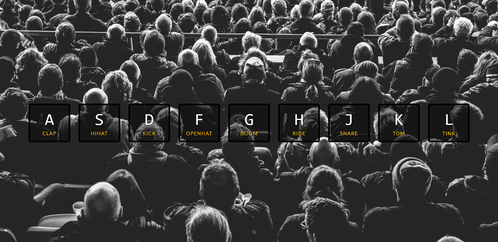

# Drum Kit
## Demo:

## Live:
https://sebastianjuszczynski.github.io/30-day-vanilla-js-coding-challenge/day1
## Technologies
- HTML
- CSS
- JS
### Description
Use key "A", "S", "D", "F", "G", "H", "J", "K", "L" to hear a sound of drums ;) 
And of course put the speakers on :)

First project from 30 days challenge by **Wes Bos**
